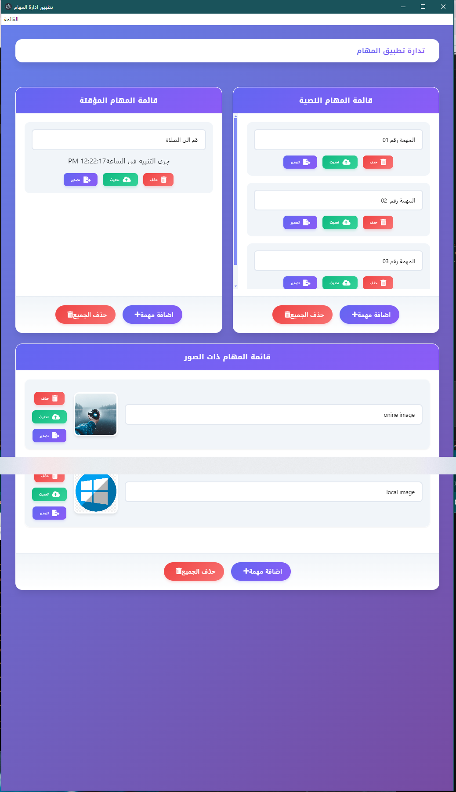

# تطبيق إدارة المهام - Task Manager App

🎓 خامس تطبيق للتدريب
هذا التطبيق هو التطبيق الخامس في سلسلة تطبيقات التدريب العملي من دورة أكاديمية حاسوب - ElectronJs.



## 📋 نظرة عامة

تطبيق سطح مكتب لإدارة المهام اليومية مبني باستخدام **ElectronJs** و **JavaScript**. يتيح لك التطبيق إضافة المهام النصية، المهام المؤقتة، والمهام مع الصور مع إمكانية تخزينها محلياً.

## 🚀 المميزات

- ✅ **مهام نصية**: إضافة وتعديل وحذف المهام النصية
- ⏰ **مهام مؤقتة**: إضافة مهام مع مؤقت للتنبيه
- 🖼️ **مهام مع صور**: إضافة صور من الجهاز أو باستخدام رابط
- 💾 **تخزين محلي**: استخدام IndexedDB مع JsStore
- 🔔 **إشعارات**: تنبيهات للمهام المؤقتة
- 📤 **تصدير**: تصدير المهام إلى ملف نصي
- 🎨 **واجهة حديثة**: تصميم عصري وجذاب

## 🛠️ التقنيات المستخدمة

- **ElectronJs**: بناء تطبيق سطح المكتب
- **JavaScript**: لغة البرمجة الأساسية
- **HTML5/CSS3**: هيكل وتصميم الواجهة
- **JsStore**: قاعدة بيانات محلية (IndexedDB)
- **Font Awesome**: أيقونات جميلة
- **Bootstrap**: إطار عمل للتصميم (اختياري)

## 📦 التثبيت والتشغيل

### المتطلبات الأساسية

- Node.js (الإصدار 14 أو أحدث)
- npm (مدير الحزم)

### خطوات التثبيت

```bash

# 1. تثبيت الاعتماديات
npm install

# 2. تشغيل التطبيق
npm run start
```
